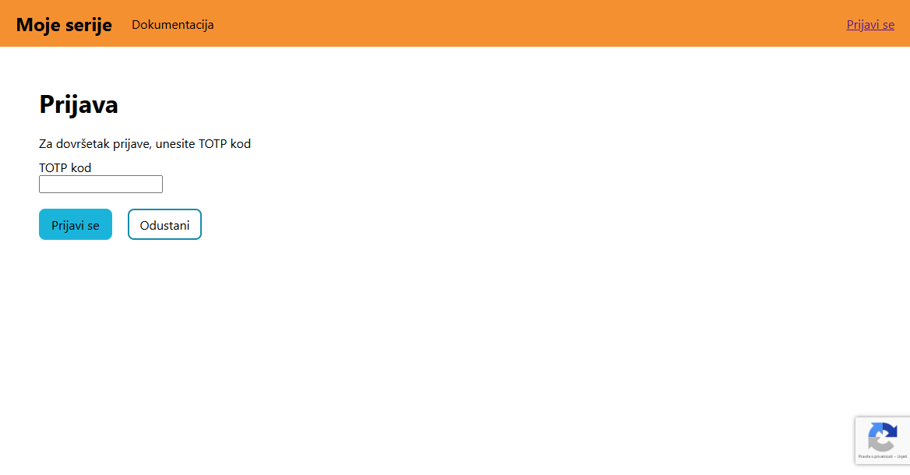
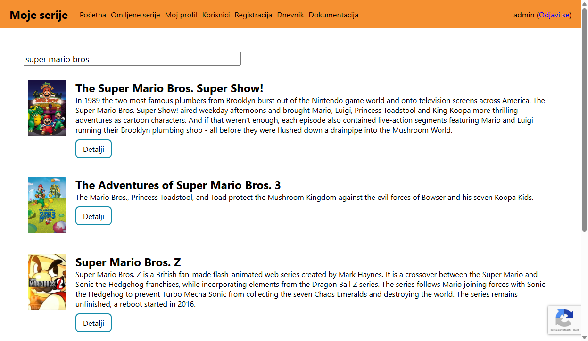
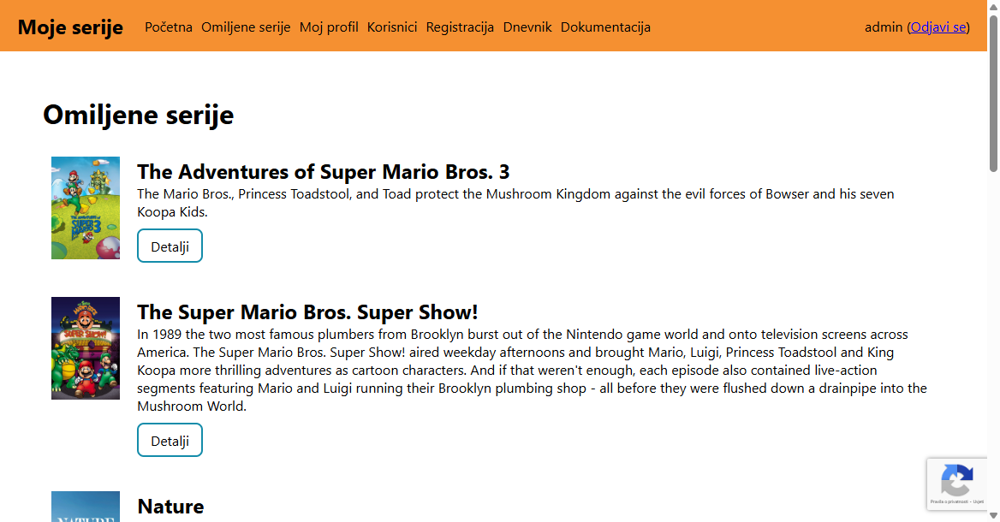
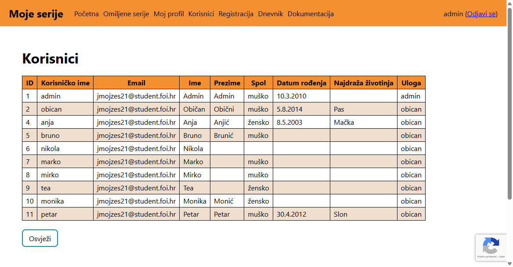
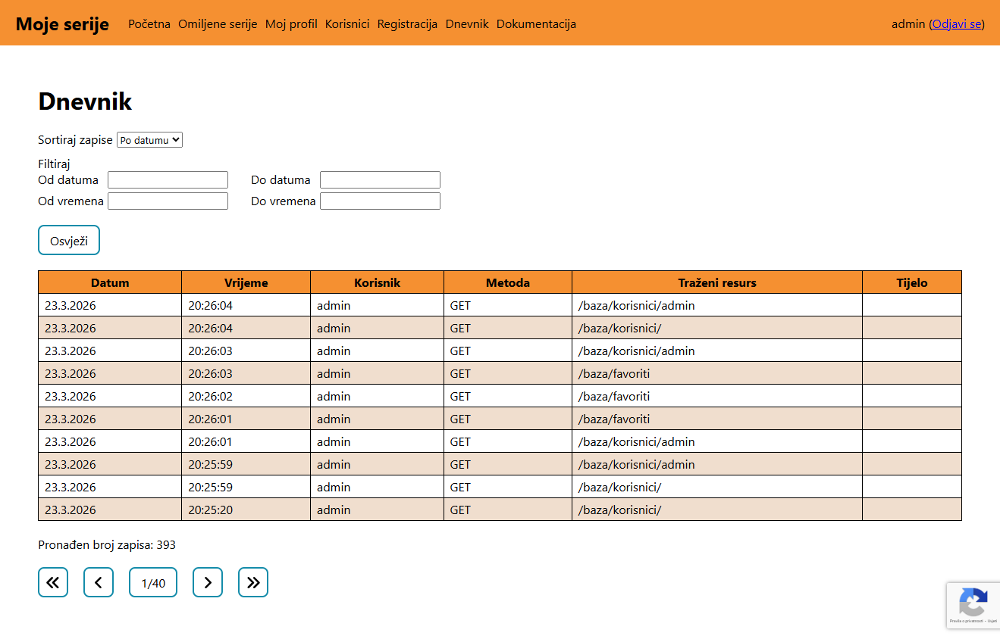

# Projekt iz kolegija Razvoj web aplikacija

Ovaj repozitorij obuhvaća projekt na kolegiju Razvoj web aplikacija 
(prijediplomski studij Razvoj programskih sustava).
Cilj projekta je bio razviti backend i frontend dio web aplikacije za pregled
serija.

## Tehnologije
* Node.js, Express.js
* Angular, TypeScript

## Pokretanje

Postoje 2 načina pokretanja web aplikacije.

### Development

U ovom načinu potrebno je pokrenuti Angular web aplikaciju i backend. Pokrenite backend tako da se prebacite u server mapu `cd server` i 
izvršite naredbu `npm run dev`. 

Pokrenite Angular tako da se
prebacite u angular mapu `cd angular` i izvršite naredbu `npm run start`.

### Production

Stvorite produkcijsku verziju Angular web aplikacije `npm run build` te kopirajte sadržaj mape `angular/dist/serije/browser`
u mapu `server/angular`. Pokrenite backend sa naredbom `npm run start`.

## Slike web aplikacije

### Prijava - dvorazinska autentifikacija

* Korisnici mogu uključiti i isključiti dvorazinsku autentifikaciju

### Početna stranica

* Pretraživanje serija te korištenje [TMDB API-a](https://developer.themoviedb.org/docs/getting-started)

### Omiljene serije

* Prikaz omiljenih serija za korisnika

### Korisnici

* Prikaz svih korisnika
* Ograničeno samo za administratora

### Dnevnik - straničenje

* Prikaz dnevnika
* Ograničeno samo za administratora
* Straničenje velike količine podataka

## Struktura repozitorija

| Mapa | Opis |
|-|-|
| angular | Frontend dio, odnosno Angular web aplikacija. |
| server | Backend dio koji pruža web servise. |
